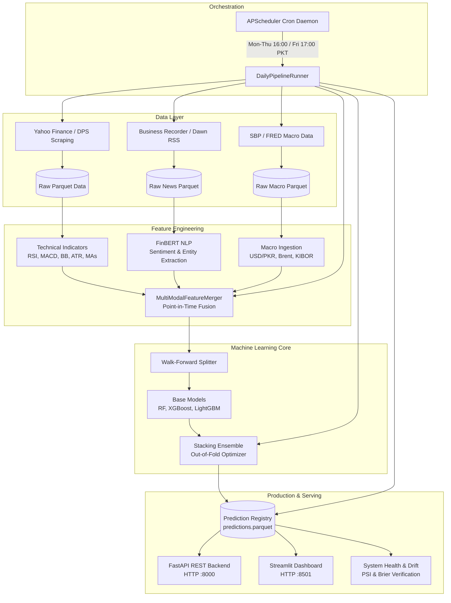

# Pakistan Stock Exchange (PSX) Prediction Platform

[](https://www.python.org/downloads/)
[]()
[](https://github.com/astral-sh/ruff)
[](http://mypy-lang.org/)
[](LICENSE)

An institutional-grade, end-to-end quantitative analytics, machine learning, and automated predictive modeling platform designed specifically for the **Pakistan Stock Exchange (PSX)**.

The platform explicitly incorporates local market microstructures (circuit breaker locks at $\pm7.5\%$, Friday split prayer sessions, high-dividend corporate actions, and transaction friction), combining historical price action, multi-modal feature engineering, FinBERT financial sentiment NLP, macroeconomic indicator synchronization, and a stacked meta-learner ensemble.

---

## Table of Contents
1. [Key Architecture Highlights](#key-architecture-highlights)
2. [End-to-End Platform Architecture](#end-to-end-platform-architecture)
3. [Quick Start & Installation](#quick-start--installation)
4. [Complete CLI Command Reference](#complete-cli-command-reference)
   - [Configuration & Inspection](#1-configuration--inspection-psx-config)
   - [Data Ingestion & Quality](#2-data-ingestion--quality-psx-data)
   - [Feature Engineering & Multi-Modal Merger](#3-feature-engineering--multi-modal-merger-psx-features)
   - [Machine Learning & Backtesting](#4-machine-learning--backtesting-psx-model)
   - [Live Forecasts & Audit Trail](#5-live-forecasts--audit-trail-psx-predict)
   - [Financial News & NLP](#6-financial-news--nlp-psx-news)
   - [Macroeconomic Indicators](#7-macroeconomic-indicators-psx-macro)
   - [FastAPI REST Backend](#8-fastapi-rest-backend-psx-api)
   - [Streamlit Research Dashboard](#9-streamlit-research-dashboard-psx-dashboard)
   - [Scheduled Automation & Daemon](#10-scheduled-automation--daemon-psx-schedule)
   - [Model Monitoring & Drift Detection](#11-model-monitoring--drift-detection-psx-health)
5. [Interactive Streamlit Dashboard Guide](#interactive-streamlit-dashboard-guide)
6. [FastAPI REST Backend API Guide](#fastapi-rest-backend-api-guide)
7. [Automated Daily Operational Routine](#automated-daily-operational-routine)
8. [Testing & Static Analysis](#testing--static-analysis)
9. [Project Directory Layout](#project-directory-layout)

---

## Key Architecture Highlights

- **PSX Microstructure Fidelity:** Explicit enforcement of $\pm7.5\%$ statutory circuit breaker price bands, high-dividend cash/bonus adjustments, realistic Pakistani broker commission structures (0.15% fee/commission model with regulatory turnover levies), and Friday split session timings.
- **Local-First Analytical Engine:** High-performance columnar storage using Apache Parquet with atomic write swaps and in-process DuckDB analytical SQL execution.
- **Zero Look-Ahead Bias:** Strict point-in-time chronological joins for all technical, news sentiment, and macroeconomic variables.
- **Multi-Modal Feature Fusion:** Dynamic point-in-time fusion of 25+ technical indicators, FinBERT NLP sentiment scores, corporate announcement categories, USD/PKR exchange rates, SBP policy rates, KIBOR, and Brent crude oil.
- **Stacking Meta-Learner Ensemble:** Out-of-fold probability weight optimization blending specialized base classifiers (Random Forest, LightGBM, XGBoost, and Logistic Regression).
- **Automated Operational Daemon:** Session-aligned APScheduler cron triggers configured for Pakistan Standard Time (`Asia/Karachi`):
  - **Monday – Thursday:** Market close at 15:30 PKT $\to$ Automated pipeline runs at 16:00 PKT.
  - **Friday:** Market close at 16:30 PKT $\to$ Automated pipeline runs at 17:00 PKT.
- **Continuous Reliability & Drift Monitoring:** Real-time Population Stability Index (PSI) drift tracking with regulatory thresholds and rolling 30-day / 90-day probability verification Brier scoring.

---

## End-to-End Platform Architecture



---

## Quick Start & Installation

### Prerequisites
- Python $\ge$ 3.12
- [uv](https://github.com/astral-sh/uv) (strongly recommended) or standard `pip`

### Step 1: Clone Repository
```bash
git clone https://github.com/masimbutt001/PSX_Prediction.git
cd PSX_Prediction
```

### Step 2: Set Up Virtual Environment & Dependencies
Using `uv`:
```bash
# Automatically creates .venv and installs all production & development dependencies
uv sync
```

Or using standard `pip`:
```bash
python -m venv .venv
# On Windows:
.venv\Scripts\activate
# On Linux/macOS:
source .venv/bin/activate

pip install -e ".[dev]"
```

### Step 3: Verify Installation
```bash
uv run psx version
uv run psx config show
```

---

## Complete CLI Command Reference

The command-line interface `psx` is built with [Typer](https://typer.tiangolo.com/) and provides rich, colorized terminal outputs across 11 functional subsystems.

### 1. Configuration & Inspection (`psx config`)
```bash
# Display active settings, directories, and configured PSX stock universe
uv run psx config show

# Use a custom configuration directory
uv run psx config show --config-dir /path/to/config
```

### 2. Data Ingestion & Quality (`psx data`)
```bash
# Bootstrap 5 years of historical OHLCV data for all enabled stocks
uv run psx data bootstrap

# Bootstrap specific symbols with custom lookback years
uv run psx data bootstrap --symbols OGDC,HBL,LUCK --years 3

# Execute daily incremental price ingestion
uv run psx data update

# Update a subset of symbols
uv run psx data update --symbols SYS,ENGRO

# Inspect data quality and identify missing sessions or anomalies
uv run psx data quality
```

### 3. Feature Engineering & Multi-Modal Merger (`psx features`)
```bash
# Compute technical indicators (RSI, MACD, Bollinger Bands, ATR, MAs)
uv run psx features build

# Build technical indicators for specific symbols
uv run psx features build --symbols OGDC,PPL

# Fuse technicals, news sentiment, and macro indicators into combined feature matrices
uv run psx features merge

# Merge specific symbols
uv run psx features merge --symbols OGDC,HBL
```

### 4. Machine Learning & Backtesting (`psx model`)
```bash
# Train predictive models (baseline, tree models, or stacking ensemble)
uv run psx model train --symbol OGDC --model-type stacking

# Available model types: baseline, rf, lgbm, xgboost, stacking
uv run psx model train --symbol HBL --model-type lgbm

# Run a walk-forward chronological backtest with 0.15% friction
uv run psx model backtest --symbol OGDC --strategy momentum

# Backtest a moving average crossover strategy
uv run psx model backtest --symbol LUCK --strategy macrossover --short-window 10 --long-window 30
```

### 5. Live Forecasts & Audit Trail (`psx predict`)
```bash
# Generate out-of-sample forward prediction for a stock and log to registry
uv run psx predict generate --symbol OGDC

# Reconcile historical forecasts against realized market closes (hit rate & Brier score)
uv run psx predict audit

# Audit a specific symbol's predictions
uv run psx predict audit --symbol OGDC
```

### 6. Financial News & NLP (`psx news`)
```bash
# Scrape financial RSS news (Business Recorder, Dawn) and DPS corporate announcements
uv run psx news collect

# Collect DPS announcements only
uv run psx news collect --source dps --count 50

# Run FinBERT sentiment analysis and entity extraction on collected news
uv run psx news process

# Run news extraction in dry-run mode
uv run psx news process --dry-run
```

### 7. Macroeconomic Indicators (`psx macro`)
```bash
# Synchronize USD/PKR, Brent crude, KIBOR, and SBP monetary policy rates
uv run psx macro update

# Inspect latest macroeconomic data series
uv run psx macro show
```

### 8. FastAPI REST Backend (`psx api`)
```bash
# Start the production REST API server (default: http://127.0.0.1:8000)
uv run psx api start

# Run on custom host/port with hot-reload enabled
uv run psx api start --host 0.0.0.0 --port 8080 --reload

# Validate API server configuration without binding ports
uv run psx api start --dry-run
```

### 9. Streamlit Research Dashboard (`psx dashboard`)
```bash
# Launch interactive Streamlit research dashboard (default: http://127.0.0.1:8501)
uv run psx dashboard

# Launch on custom port
uv run psx dashboard --port 8502

# Dry-run validation check
uv run psx dashboard --dry-run
```

### 10. Scheduled Automation & Daemon (`psx schedule`)
```bash
# Inspect automated cron triggers, PSX market session timings, and run history
uv run psx schedule status

# Run the 6-step EOD operational pipeline immediately in dry-run mode
uv run psx schedule run-daily --dry-run

# Run the full live EOD pipeline immediately (all enabled symbols)
uv run psx schedule run-daily

# Run the live pipeline for specific symbols, continuing if non-critical steps fail
uv run psx schedule run-daily --symbols OGDC,HBL --continue-on-error

# Launch the long-running APScheduler process in foreground blocking mode
uv run psx schedule start

# Launch scheduler daemon in background non-blocking mode
uv run psx schedule start --daemon
```

### 11. Model Monitoring & Drift Detection (`psx health`)
```bash
# Run comprehensive platform diagnostic audit (data feeds, calibration, and drift)
uv run psx health check

# Check health for a subset of symbols with detailed reporting
uv run psx health check --symbols OGDC,HBL,SYS --detailed

# Inspect Population Stability Index (PSI) and KS-test drift for a specific stock
uv run psx health drift --symbol OGDC

# Configure custom lookback evaluation windows (trailing sessions vs baseline)
uv run psx health drift --symbol OGDC --recent-sessions 60 --reference-sessions 250
```

---

## Interactive Streamlit Dashboard Guide

The platform includes a multi-page interactive web application built with Streamlit and Plotly in a sleek dark theme (`#0e1117`).

### Launching the Dashboard
```bash
uv run psx dashboard
# Alternatively:
uv run streamlit run src/psx_predictor/dashboard/app.py
```
Open your browser at `http://localhost:8501`.

### Dashboard Navigation & Views

```
Streamlit Application
├── Home (app.py)                   -> System status, universe overview, data diagnostics
├── 1_Market_Overview.py            -> Full-universe monitoring, signal badges, sector charts
├── 2_Stock_Analysis.py             -> Candlestick charts, technical indicators, ML prediction cards
└── 3_Model_Performance.py          -> Backtesting simulator, equity curves, drawdown analysis
```

1. **Home (`app.py`)**:
   - Platform operational status, storage path verification, and Parquet record availability counters.
   - Quick navigation guide and architecture summary.

2. **Market Overview (`pages/1_Market_Overview.py`)**:
   - Comprehensive universe table displaying latest closing prices, 1-day percentage change, sector classification, and latest ML signals.
   - Donut charts showing active directional signal distributions (🟢 `BUY`, 🔴 `SELL`, 🟡 `HOLD`) and sector concentration.

3. **Stock Analysis (`pages/2_Stock_Analysis.py`)**:
   - **Multi-Panel Plotly Candlestick Chart**: High-resolution interactive chart with volume bars (color-coded green/red), SMA 20, SMA 50, and 2-standard-deviation Bollinger Bands with soft fills.
   - **Forward-Looking Prediction Card**: Live directional signal badge, calibrated confidence meter, expected return, and a horizontal bar chart displaying top predictive feature drivers.
   - **On-Demand Live Inference Button**: Generate and log forward forecasts directly from the UI.

4. **Model Performance & Backtesting (`pages/3_Model_Performance.py`)**:
   - Interactive quantitative backtesting simulator for Moving Average Crossover, Momentum, and Buy-and-Hold benchmarks.
   - **Equity Growth Curve**: Compares strategy portfolio value against benchmark in Pakistani Rupees (PKR).
   - **Underwater Drawdown Chart**: Shaded area chart tracking portfolio drawdowns from peak equity.
   - **Performance KPI Grid**: Real-time calculation of Sharpe Ratio, CAGR, Max Drawdown %, and Win Rate %.

---

## FastAPI REST Backend API Guide

The platform provides a high-performance, asynchronous REST backend built with FastAPI and Pydantic v2.

### Starting the API Server
```bash
uv run psx api start --port 8000
```
Visit the interactive Swagger UI at **`http://127.0.0.1:8000/docs`**.

### Key REST Endpoints

| Method | Endpoint | Description |
| :--- | :--- | :--- |
| `GET` | `/api/v1/health` | Service health status, UTC timestamp, and version. |
| `GET` | `/api/v1/stocks` | List configured universe with sector, enabled status, and Parquet data availability. |
| `GET` | `/api/v1/stocks/{symbol}/history` | Historical OHLCV prices with optional `start_date` and `end_date` filters. |
| `GET` | `/api/v1/predictions/latest` | Latest forward forecasts across the entire universe or filtered by `?symbol=`. |
| `GET` | `/api/v1/predictions/audit` | Historical prediction outcome audit trail, realized returns, and Brier score. |
| `POST` | `/api/v1/backtest/run` | Execute backtest simulation via JSON payload with strategy parameters. |

#### Sample Request: Run Backtest via API
```bash
curl -X POST "http://127.0.0.1:8000/api/v1/backtest/run" \
     -H "Content-Type: application/json" \
     -d '{
       "symbol": "OGDC",
       "strategy": "macrossover",
       "initial_capital": 1000000,
       "parameters": {"short_window": 10, "long_window": 30}
     }'
```

---

## Automated Daily Operational Routine

The automated operational routine runs on APScheduler aligned with PSX post-market sessions in the `Asia/Karachi` timezone:

1. **Topological Pipeline Sequence (Step 1 to 6)**:
   - **Step 1: `UPDATE_PRICES`**: Fetches today's closing prices for all enabled stocks.
   - **Step 2: `COLLECT_NEWS`**: Ingests new articles via RSS & corporate announcements via DPS, scoring sentiment with FinBERT.
   - **Step 3: `UPDATE_MACRO`**: Synchronizes USD/PKR, Brent crude, KIBOR, and policy rates.
   - **Step 4: `BUILD_FEATURES`**: Generates updated technical indicators and merged multi-modal feature matrices.
   - **Step 5: `GENERATE_PREDICTIONS`**: Runs stacking ensemble forward inference across active universe and logs to registry.
   - **Step 6: `AUDIT_PREDICTIONS`**: Reconciles yesterday's predictions against today's realized returns and evaluates Brier score.
2. **Audit Logging**:
   - Every execution atomically appends a detailed execution report to `data/pipeline.log` in JSON Lines format.
3. **Resilience & Fault Tolerance**:
   - All external network actions utilize exponential backoff retries.
   - The `--continue-on-error` flag allows downstream audit and monitoring tasks to proceed even if an upstream scraper experiences a transient network error.

---

## Testing & Static Analysis

The project enforces a strict policy of **100% deterministic, offline-capable unit and integration testing** with zero tolerance for lint errors or type violations.

```bash
# Run complete test suite (179 tests across 21 modules)
uv run pytest -v

# Run linting and style checks with Ruff
uv run ruff check .

# Run strict static type checking with Mypy
uv run mypy src
```

---

## Project Directory Layout

```
PSX_Prediction/
├── config/                         # Application & stock configuration
│   ├── settings.yaml               # System parameters, paths, and timezones
│   └── stocks.yaml                 # Configured PSX universe (OGDC, HBL, LUCK, etc.)
├── data/                           # Local-first Parquet analytical storage
│   ├── raw/                        # Raw scraped prices, news, and macro series
│   ├── processed/                  # Cleaned, split-adjusted OHLCV price series
│   ├── features/                   # Technical, news NLP, and merged feature stores
│   ├── predictions/                # Permanent append-only predictions.parquet registry
│   └── pipeline.log                # Scheduled EOD operational execution audit trail
├── docs/                           # Engineering specifications and phase walkthroughs
│   └── phases/                     # Specifications for Phases 00 through 20
│       └── walkthroughs/           # Verification and implementation reports
├── src/psx_predictor/              # Core application package
│   ├── api/                        # FastAPI REST service & Pydantic schemas
│   ├── backtest/                   # Walk-forward backtester & performance analytics
│   ├── cli/                        # Typer CLI subcommands & Rich visual formatting
│   ├── config/                     # YAML configuration loaders & validators
│   ├── dashboard/                  # Streamlit multi-page research dashboard
│   ├── data/                       # Market data collectors (DPS, Yahoo Finance)
│   ├── features/                   # Technical indicator builders & multi-modal mergers
│   ├── macro/                      # Macroeconomic indicator ingestors
│   ├── models/                     # Base models, tree models, and stacking ensemble
│   ├── monitoring/                 # Drift detection (PSI, KS-test) & Brier calibration
│   ├── news/                       # RSS collectors, DPS announcements & FinBERT NLP
│   ├── predictions/                # Live prediction engine, registry & auditor
│   ├── processing/                 # Corporate actions, calendar sessions & incremental updater
│   ├── scheduler/                  # APScheduler EOD runner, cron triggers & jobs
│   └── storage/                    # Atomic Parquet I/O & DuckDB catalog
├── tests/                          # Complete automated test suite (179 tests)
│   ├── unit/                       # Unit tests for all individual subsystems
│   └── integration/                # End-to-end multi-step integration tests
├── pyproject.toml                  # Project metadata, dependencies, and tooling configuration
└── README.md                       # Comprehensive platform documentation and run guide
```

---

## License

This project is licensed under the MIT License — see the [LICENSE](LICENSE) file for details.
