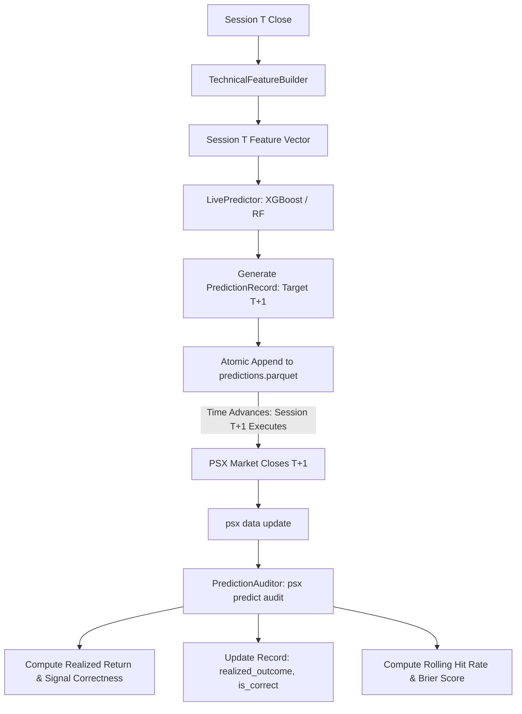

# Walkthrough — Phase 10: Prediction Registry & Audit Log

**Status:** Completed & Validated  
**Date:** September 2026  
**Specification:** [phase_10_prediction_registry.md](../phase_10_prediction_registry.md)

---

## 1. Objective Accomplished
Built an immutable, append-only prediction registry and automated reconciliation engine for PSX market forecasting:
1. **Pydantic Schema Invariant (`PredictionRecord`)**: Ensures every live forecast is stamped with a UUIDv4, UTC generation timestamp, target session date ($T+1$), model architecture, probability distribution, directional signal (`BUY`, `SELL`, `HOLD`), confidence score, and top feature drivers before the trading session occurs.
2. **Atomic Parquet Storage (`PredictionRegistry`)**: Implements append-only persistence to `data/predictions/predictions.parquet` with atomic writes, querying, filtering, and deduplication.
3. **Live Predictor Engine (`LivePredictor`)**: Fits or loads models (XGBoost, Random Forest, Logistic Regression) on historical data, ingests the most recent closed session vector $T$, computes next-session forecast $T+1$ (skipping weekends), and logs to the registry.
4. **Audit Reconciliation Engine (`PredictionAuditor`)**: Compares pending predictions against actual market close prices in `data/processed/prices/{symbol}.parquet`, computing realized returns, signal correctness, directional hit rate, and Brier calibration score ($\frac{1}{N}\sum (p_{up} - y_{realized})^2$).
5. **Typer CLI Integration**: Registered `psx predict` and `psx predict audit` commands with Rich summary tables.

---

## 2. Deliverables & Files Created / Modified

| File | Purpose |
| :--- | :--- |
| [`src/psx_predictor/predictions/registry.py`](../../../src/psx_predictor/predictions/registry.py) | `PredictionRecord` schema and `PredictionRegistry` atomic Parquet store. |
| [`src/psx_predictor/predictions/predictor.py`](../../../src/psx_predictor/predictions/predictor.py) | `LivePredictor` computing forward forecasts for session $T+1$ and feature drivers. |
| [`src/psx_predictor/predictions/auditor.py`](../../../src/psx_predictor/predictions/auditor.py) | `PredictionAuditor` and `display_audit_report` reconciling realized closes and Brier score. |
| [`src/psx_predictor/predictions/__init__.py`](../../../src/psx_predictor/predictions/__init__.py) | Package public API exports. |
| [`src/psx_predictor/cli/main.py`](../../../src/psx_predictor/cli/main.py) | Added `psx predict` callback and `psx predict audit` CLI subcommands. |
| [`tests/unit/test_predictions.py`](../../../tests/unit/test_predictions.py) | 8 comprehensive unit tests covering Pydantic validation, atomic registry I/O, live inference, reconciliation, Brier score calculation, and CLI invocation. |

---

## 3. Architecture & Mathematical Invariants

### 3.1 Prediction Immutability & Lifecycle


### 3.2 Brier Calibration Score
$$\text{Brier Score} = \frac{1}{N} \sum_{i=1}^{N} \left( p_{up, i} - \mathbb{I}(r_{realized, i} > 0) \right)^2$$
- **0.00:** Perfect calibration (model assigns 1.0 to UP days and 0.0 to DOWN days).
- **0.25:** Uninformative baseline (always predicting 50% probability).
- **> 0.25:** Miscalibrated (confidently wrong).

---

## 4. Verification & Test Results

### 4.1 Code Quality & Static Typing
```powershell
uv run ruff format --check .
# Output: 59 files already formatted

uv run ruff check .
# Output: All checks passed!

uv run mypy src
# Output: Success: no issues found in 43 source files
```

### 4.2 Unit Tests Execution
```powershell
uv run pytest tests/unit/test_predictions.py -v
# Output: 8 passed in 1.50s
```

### 4.3 Full Project Regression Test
```powershell
uv run pytest -v
# Output: 93 passed, 2 deselected in 4.66s
```

### 4.4 Live CLI Invocations
```powershell
# Generate next-day prediction for OGDC
uv run psx predict --symbol OGDC --model xgboost

# Generate next-day prediction for PPL
uv run psx predict --symbol PPL --model random_forest

# Audit prediction registry and reconcile outcomes
uv run psx predict audit
```
Output:
```
                      PSX Live Prediction Registry Audit                       
+-----------------------------------------------------------------------------+
| Metric                       | Value | Benchmark / Interpretation           |
|------------------------------+-------+--------------------------------------|
| Total Registered Forecasts   |     2 | Cumulative logged predictions across |
|                              |       | universe                             |
| Reconciled Forecasts         |     0 | Historical sessions whose closing    |
|                              |       | prices have occurred                 |
| Pending / Unclosed Forecasts |     2 | Active forecasts awaiting upcoming   |
|                              |       | market close                         |
| Directional Hit Rate         |  0.0% | Accuracy of directional signal vs    |
|                              |       | realized outcome (Baseline: 50.0%)   |
| Brier Calibration Score      |   N/A | Mean squared probability error (0.00 |
|                              |       | = perfect, 0.25 = uninformative)     |
+-----------------------------------------------------------------------------+
```

---

## 5. Next Step: Phase 11 — News Collection & Parsing
With Phase 10 complete and verified, the quantitative price forecasting core is finished and fully audited. The platform is ready to advance to **Phase 11: News Collection & Parsing**, implementing news scraping and RSS feeds from Dawn, Business Recorder, and Pakistan Today.
