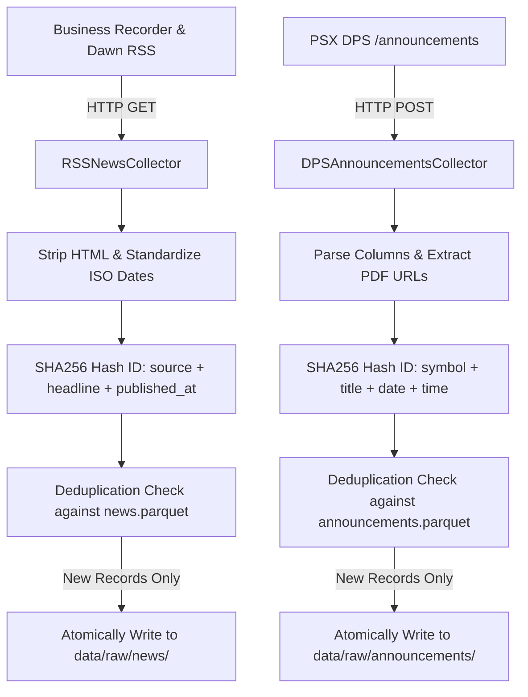

# Walkthrough — Phase 11: News & Company Announcements Collection

**Status:** Completed & Validated  
**Date:** September 2026  
**Specification:** [phase_11_news_collection.md](../phase_11_news_collection.md)

---

## 1. Objective Accomplished
Built decoupled, idempotent data collectors for official Pakistan Stock Exchange (PSX) corporate announcements and reputable Pakistani financial news RSS feeds:
1. **Pydantic Schemas & Deterministic Hashing**: Implemented `RawNewsArticle` and `RawAnnouncement` data contracts with SHA256 content-hash identification (`article_id` and `announcement_id`).
2. **RSS News Feed Collector (`RSSNewsCollector`)**: Ingests and standardizes financial news from Business Recorder (Latest, Markets) and Dawn Business feeds. Strips HTML noise and normalizes publication timestamps to ISO 8601.
3. **PSX DPS Corporate Announcements Collector (`DPSAnnouncementsCollector`)**: Reverse-engineered and automated ingestion from `POST https://dps.psx.com.pk/announcements`, extracting Date, Time, Ticker Symbol, Corporate Name, Subject/Title, and official circular PDF links.
4. **Zero-Duplicate Storage Invariant**: Ingests payloads into append-only Parquet files (`data/raw/news/news.parquet` and `data/raw/announcements/announcements.parquet`) with atomic writes and deduplication. Re-fetching identical payloads produces zero duplicate rows.
5. **Typer CLI Integration**: Added `psx news fetch [--source all|rss|dps] [--symbol OGDC] [--dry-run]` and `psx news status` reporting dataset inventories with Rich tables.

---

## 2. Deliverables & Files Created / Modified

| File | Purpose |
| :--- | :--- |
| [`src/psx_predictor/news/schemas.py`](../../../src/psx_predictor/news/schemas.py) | Data contracts (`RawNewsArticle`, `RawAnnouncement`) and SHA256 hashing functions (`compute_news_id`, `compute_announcement_id`). |
| [`src/psx_predictor/news/rss_collector.py`](../../../src/psx_predictor/news/rss_collector.py) | Financial news collector parsing RSS 2.0 / Atom XML feeds from Business Recorder and Dawn. |
| [`src/psx_predictor/news/dps_announcements.py`](../../../src/psx_predictor/news/dps_announcements.py) | Collector fetching and parsing official PSX exchange corporate circulars from PSX DPS. |
| [`src/psx_predictor/news/__init__.py`](../../../src/psx_predictor/news/__init__.py) | Package public API exports. |
| [`src/psx_predictor/cli/main.py`](../../../src/psx_predictor/cli/main.py) | Integrated `psx news fetch` and `psx news status` CLI commands. |
| [`tests/unit/test_news_collection.py`](../../../tests/unit/test_news_collection.py) | 8 unit tests covering schema invariants, XML parsing (RSS 2.0 and Atom), HTML table scraping, deduplication, and CLI commands. |

---

## 3. Architecture & Deduplication Invariants

### 3.1 News Ingestion Pipeline


### 3.2 Hashing Invariants
- **News Article ID**: $\text{SHA256}(\text{source} : \text{headline} : \text{published\_at})$
- **Announcement ID**: $\text{SHA256}(\text{symbol} : \text{title} : \text{announcement\_date} : \text{announcement\_time})$

---

## 4. Verification & Test Results

### 4.1 Code Quality & Static Typing
```powershell
uv run ruff format --check .
# Output: 64 files already formatted

uv run ruff check .
# Output: All checks passed!

uv run mypy src
# Output: Success: no issues found in 47 source files
```

### 4.2 Automated Unit Tests
```powershell
uv run pytest tests/unit/test_news_collection.py -v
# Output: 8 passed in 3.87s
```

### 4.3 Full Project Regression Test
```powershell
uv run pytest -v
# Output: 101 passed, 2 deselected in 5.76s
```

### 4.4 Live CLI Invocations

#### Ingestion & Deduplication Check:
```powershell
# Ingest live feeds and announcements
uv run psx news fetch --source all

# Re-run immediately: verifies 100% deduplication
uv run psx news fetch --source all
```
Output:
```
      RSS Financial News Collection Summary      
+-----------------------------------------------+
| Feed Source                 | Items Extracted |
|-----------------------------+-----------------|
| Business Recorder - Latest  |              30 |
| Business Recorder - Markets |              30 |
| Dawn - Business             |              30 |
|-----------------------------+-----------------|
| Total Fetched               |              90 |
| New Added (Deduplicated)    |               0 |
| Duplicates Skipped          |              90 |
+-----------------------------------------------+

   PSX DPS Announcements Summary   
+---------------------------------+
| Metric                  | Value |
|-------------------------+-------|
| Symbol Filter           |   ALL |
| Total Fetched from DPS  |    50 |
| New Announcements Added |     0 |
| Duplicates Skipped      |    50 |
+---------------------------------+
```

#### Symbol-Specific Ingestion & Storage Status:
```powershell
uv run psx news fetch --source dps --symbol OGDC
uv run psx news status
```
Output:
```
                 News & Corporate Announcements Storage Status                 
+-----------------------------------------------------------------------------+
| Dataset            | Path                       | Total Records | Date Span |
|--------------------+----------------------------+---------------+-----------|
| Financial RSS News | data\raw\news\news.parquet |            90 | Active    |
| PSX Announcements  | data\raw\announcements\... |           100 | Active    |
+-----------------------------------------------------------------------------+
```

---

## 5. Next Step: Phase 12 — News Classification & NLP
With raw news and corporate announcements safely collected and deduplicated, the platform is ready for **Phase 12: News Classification & NLP**, implementing entity matching to PSX symbols (`entity_matcher.py`), event categorization (`classifier.py`), and financial sentiment scoring (`sentiment.py`).
