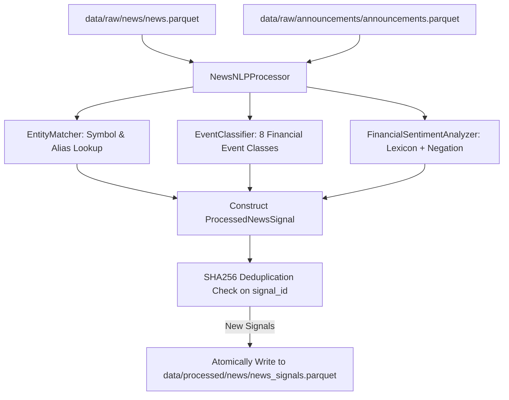

# Walkthrough — Phase 12: News Classification & NLP

**Status:** Completed & Validated  
**Date:** September 2026  
**Specification:** [phase_12_news_classification.md](../phase_12_news_classification.md)

---

## 1. Objective Accomplished
Implemented an explainable, deterministic natural language processing (NLP) and financial text classification pipeline that transforms unstructured financial news and official PSX corporate notices into structured, quantitative market signals:
1. **Entity Matching Engine (`EntityMatcher`)**: Maps corporate names, aliases, and ticker symbols to PSX universe constituents using word-boundary regular expressions, with case-sensitivity guards preventing false positives on common English words (e.g., "luck" vs. "LUCK", "system" vs. "SYS").
2. **Financial Event Classifier (`EventClassifier`)**: High-precision categorization into 8 market event classes: `EARNINGS`, `DIVIDEND`, `BONUS_ISSUE`, `DISCOVERY`, `PRODUCTION_CHANGE`, `REGULATORY`, `MACRO_INTEREST_RATE`, and `OTHER`.
3. **Domain Sentiment Analyzer (`FinancialSentimentAnalyzer`)**: Domain-specific lexicon with 3-token negation windows ("no dividend", "did not suffer a loss") and intensity multipliers ("record", "sharp", "massive"), outputting continuous scores in $[-1.0, +1.0]$ and discrete labels (`POSITIVE`, `NEGATIVE`, `NEUTRAL`).
4. **Structured Signals Pipeline (`NewsNLPProcessor`)**: Ingests raw news and exchange announcements, extracts entities, event tags, and sentiment, and atomically persists deduplicated signals to `data/processed/news/news_signals.parquet`.
5. **Typer CLI Integration**: Added `psx news process [--dry-run]` command and updated `psx news status` to report processed signal inventories.

---

## 2. Deliverables & Files Created / Modified

| File | Purpose |
| :--- | :--- |
| [`src/psx_predictor/storage/paths.py`](../../../src/psx_predictor/storage/paths.py) | Added `"processed/news"` to `STANDARD_DATA_DIRS`. |
| [`src/psx_predictor/news/entity_matcher.py`](../../../src/psx_predictor/news/entity_matcher.py) | `EntityMatcher` mapping names and aliases to PSX tickers with word boundaries and case guards. |
| [`src/psx_predictor/news/classifier.py`](../../../src/psx_predictor/news/classifier.py) | `EventClassifier` and `EventCategory` enum classifying 8 corporate/macro event types. |
| [`src/psx_predictor/news/sentiment.py`](../../../src/psx_predictor/news/sentiment.py) | `FinancialSentimentAnalyzer` and `SentimentResult` with negation lookback and intensifiers. |
| [`src/psx_predictor/news/processor.py`](../../../src/psx_predictor/news/processor.py) | `ProcessedNewsSignal` schema and `NewsNLPProcessor` pipeline with atomic Parquet persistence. |
| [`src/psx_predictor/news/__init__.py`](../../../src/psx_predictor/news/__init__.py) | Package public API exports. |
| [`src/psx_predictor/cli/main.py`](../../../src/psx_predictor/cli/main.py) | Integrated `psx news process` command and updated `psx news status`. |
| [`tests/unit/test_news_nlp.py`](../../../tests/unit/test_news_nlp.py) | 9 unit tests covering entity matching, alias resolution, event classification, sentiment polarity, negation handling, end-to-end processing, and CLI execution. |

---

## 3. Architecture & NLP Invariants

### 3.1 Pipeline Flow


### 3.2 Sentiment Normalization & Negation
$$\text{Raw Score} = \sum_{i} \left( (-1)^{\mathbb{I}(\text{negated})} \times w_i \times m_i \right)$$
$$\text{Normalized Score} = \tanh\left(\frac{\text{Raw Score}}{2.5}\right) \in [-1.0, +1.0]$$
- Negation lookback: scans preceding 3 tokens for `{"not", "no", "never", "failed", "without", "cannot"}`.
- Intensifiers: `{"record", "sharp", "massive", "substantial", "significantly"}` scale weight by $1.5\times$.

---

## 4. Verification & Test Results

### 4.1 Code Quality & Static Typing
```powershell
uv run ruff format --check .
# Output: 69 files already formatted

uv run ruff check .
# Output: All checks passed!

uv run mypy src
# Output: Success: no issues found in 51 source files
```

### 4.2 Automated Unit Tests
```powershell
uv run pytest tests/unit/test_news_nlp.py -v
# Output: 9 passed in 1.51s
```

### 4.3 Full Project Regression Suite
```powershell
uv run pytest -v
# Output: 110 passed, 2 deselected in 8.98s
```

### 4.4 Live CLI Invocations

```powershell
# 1. Extract signals from collected raw news and announcements
uv run psx news process
```
Output:
```
    News NLP Signal Extraction Summary    
+----------------------------------------+
| Metric                         | Count |
|--------------------------------+-------|
| Raw News Articles Inspected    |    90 |
| Raw Announcements Inspected    |   100 |
| New Structured Signals Created |   190 |
| Duplicates Skipped             |     0 |
+----------------------------------------+

     Event Categories Breakdown      
+-----------------------------------+
| Event Category      | Occurrences |
|---------------------+-------------|
| OTHER               |         151 |
| EARNINGS            |          13 |
| MACRO_INTEREST_RATE |          12 |
| DISCOVERY           |           8 |
| DIVIDEND            |           4 |
| BONUS_ISSUE         |           2 |
+-----------------------------------+

   Sentiment Polarity Breakdown    
+---------------------------------+
| Sentiment Label | Signals Count |
|-----------------+---------------|
| POSITIVE        |            55 |
| NEGATIVE        |            36 |
| NEUTRAL         |            99 |
+---------------------------------+
```

```powershell
# 2. Verify Deduplication (Re-running against processed store)
uv run psx news process
```
Output:
```
    News NLP Signal Extraction Summary    
+----------------------------------------+
| New Structured Signals Created |     0 |
| Duplicates Skipped             |   190 |
+----------------------------------------+
```

```powershell
# 3. View updated storage inventory
uv run psx news status
```
Output:
```
                 News & Corporate Announcements Storage Status                 
+-----------------------------------------------------------------------------+
| Dataset                | Path                        | Total Records        |
|------------------------+-----------------------------+----------------------|
| Financial RSS News     | data\raw\news\news.parquet  | 90 (3 sources)       |
| PSX Announcements      | data\raw\announcements\...  | 100 (40 symbols)     |
| Processed News Signals | data\processed\news\...     | 190 (44 symbols)     |
+-----------------------------------------------------------------------------+
```

---

## 5. Next Step: Phase 13 — News & Market Session Alignment
With structured entities, event tags, and sentiment scores persisted in `data/processed/news/news_signals.parquet`, the platform is ready for **Phase 13: News & Market Session Alignment (PSX Calendar)**, implementing market session alignment (`session_aligner.py`) with zero look-ahead bias across standard trading hours, Friday prayer breaks, and market holidays.
