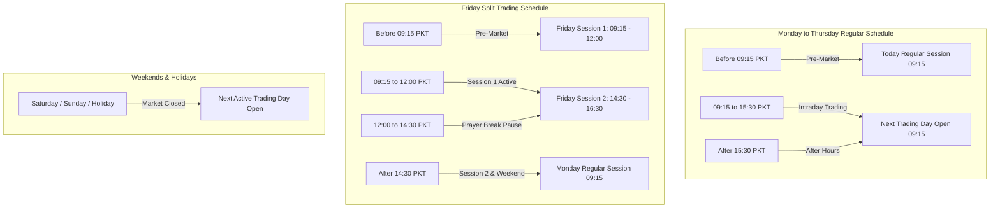

# Walkthrough — Phase 13: News & Market Session Alignment (PSX Calendar)

**Status:** Completed & Validated  
**Date:** September 2026  
**Specification:** [phase_13_news_market_alignment.md](../phase_13_news_market_alignment.md)

---

## 1. Objective Accomplished
Engineered a market calendar and temporal session aligner that bridges unstructured financial news and PSX trading sessions with **strictly zero look-ahead bias**:
1. **PSX Market Calendar (`PSXMarketCalendar`)**: Models the operational rules of the Pakistan Stock Exchange in Pakistan Standard Time (`Asia/Karachi`, PKT, UTC+5), including standard weekdays, Friday split schedules, and an exchange holiday calendar (fixed national days and declared Islamic lunar holidays).
2. **Temporal Session Aligner (`NewsSessionAligner`)**: Maps any arbitrary publication timestamp (ISO, RFC, or local) to the earliest trading session in which market participants could legitimately have executed orders:
   - **Mon – Thu Pre-Market (< 09:15 PKT)**: Usable for today's regular session.
   - **Mon – Thu Intraday (09:15 to 15:30 PKT)**: Released while trading is live; marked `is_intraday=True` and rolled to the next session open to prevent lookahead leakage in daily-open models.
   - **Mon – Thu After Hours (> 15:30 PKT)**: Usable for next trading day open.
   - **Friday Split Schedule**:
     - Pre-Market (< 09:15): Usable for Friday Session 1 (09:15–12:00).
     - Friday Session 1 (09:15 to 12:00): Actionable for **Friday Session 2** (14:30–16:30).
     - **Friday Prayer Break (12:00 to 14:30)**: Market paused; news arriving during this window aligns directly to **Friday Session 2**.
     - Friday Session 2 & After Hours (> 16:30): Usable for Monday regular session open.
   - **Weekends & Exchange Holidays**: Non-trading dates jump to the earliest active session.
3. **Point-in-Time Rolling Feature Generator**: Vectorized computation of rolling signals at session open ($T_{\text{open}} = \text{09:15 PKT}$):
   - `sentiment_24h`, `sentiment_72h`: Average polarity of eligible signals in preceding 24h/72h windows.
   - `news_count_24h`, `news_count_72h`: Total articles/announcements received.
   - `positive_count_24h`, `negative_count_24h`: Directional signal volumes.
   - `has_earnings_announcement_today`, `has_dividend_announcement_today`, `has_discovery_announcement_today`: Event indicators.
4. **Data Persistence**:
   - `data/processed/news/aligned_signals.parquet`: Enriched signals with target session dates, windows, and buffer hours.
   - `data/features/news/{SYMBOL}.parquet` and `data/features/news/daily_news_features.parquet`: Session-aligned daily features for downstream multimodal models (Phase 15).
5. **CLI Integration**:
   - `psx news align [--symbols SYMBOL] [--dry-run]`: Aligns signals and builds daily features.
   - `psx news status`: Live reporting of aligned datasets and feature records.

---

## 2. Deliverables & Files Created / Modified

| File | Purpose |
| :--- | :--- |
| [`src/psx_predictor/storage/paths.py`](../../../src/psx_predictor/storage/paths.py) | Added `"features/news"` to `STANDARD_DATA_DIRS`. |
| [`src/psx_predictor/news/calendar.py`](../../../src/psx_predictor/news/calendar.py) | `PSXMarketCalendar` managing PKT timezone, session schedules, and exchange holidays. |
| [`src/psx_predictor/news/session_aligner.py`](../../../src/psx_predictor/news/session_aligner.py) | `NewsSessionAligner` mapping timestamps without lookahead and aggregating rolling point-in-time features. |
| [`src/psx_predictor/news/__init__.py`](../../../src/psx_predictor/news/__init__.py) | Exported calendar and session aligner API. |
| [`src/psx_predictor/cli/main.py`](../../../src/psx_predictor/cli/main.py) | Integrated `psx news align` command and enhanced `psx news status` table. |
| [`tests/unit/test_news_alignment.py`](../../../tests/unit/test_news_alignment.py) | 13 unit tests covering calendar math, after-hours, Friday prayer break, weekends, holidays, and point-in-time zero leakage. |

---

## 3. Architecture & Calendar Rules

### 3.1 PSX Operating Windows & Alignment Map



### 3.2 Zero Lookahead Formal Invariant
For a trading session at date $D$ with market open time $T_{\text{open}}(D) = \text{09:15 PKT}$:
$$\mathcal{S}_{\text{eligible}}(D) = \left\{ s \in \text{Signals} \;\middle|\; T_{\text{pub}}(s) < T_{\text{open}}(D) \right\}$$
Rolling 24-hour and 72-hour historical windows:
$$\mathcal{W}_{24\text{h}}(D) = \left\{ s \in \mathcal{S}_{\text{eligible}}(D) \;\middle|\; T_{\text{open}}(D) - 24\text{h} < T_{\text{pub}}(s) \le T_{\text{open}}(D) \right\}$$
$$\mathcal{W}_{72\text{h}}(D) = \left\{ s \in \mathcal{S}_{\text{eligible}}(D) \;\middle|\; T_{\text{open}}(D) - 72\text{h} < T_{\text{pub}}(s) \le T_{\text{open}}(D) \right\}$$
$$\text{sentiment\_24h}(D) = \begin{cases} \frac{1}{|\mathcal{W}_{24\text{h}}(D)|} \sum_{s \in \mathcal{W}_{24\text{h}}(D)} \text{score}(s) & \text{if } |\mathcal{W}_{24\text{h}}(D)| > 0 \\ 0.0 & \text{otherwise} \end{cases}$$

---

## 4. Verification & Validation Results

### 4.1 Code Quality & Static Typing
```powershell
uv run ruff check .
# Output: All checks passed!

uv run mypy src
# Output: Success: no issues found in 53 source files
```

### 4.2 Automated Unit & Regression Tests
```powershell
uv run pytest tests/unit/test_news_alignment.py -v
# Output: 13 passed in 0.61s

uv run pytest -v
# Output: 123 passed, 2 deselected in 10.07s
```

### 4.3 Live CLI Invocations

```powershell
# 1. Align all processed signals with PSX calendar and generate daily features
uv run psx news align
```
Output:
```text
                 PSX Market Session Alignment Summary                  
+---------------------------------------------------------------------+
| Metric                                   |                    Value |
|------------------------------------------+--------------------------|
| Total Signals Aligned                    |                      190 |
| Intraday Signals (Rolled to Next Window) |                       99 |
| Off-Hours / Pre-Market Signals           |                       91 |
| Trading Sessions Covered                 |                       46 |
| Session Date Span                        | 2025-11-21 -> 2026-09-11 |
| Daily Feature Records Generated          |                    9,180 |
| Symbols Enriched                         |                       45 |
+---------------------------------------------------------------------+

      Session Window Distribution      
+-------------------------------------+
| Session Window Type | Signals Count |
|---------------------+---------------|
| FRIDAY_SESSION_1    |           105 |
| REGULAR             |            79 |
| FRIDAY_SESSION_2    |             6 |
+-------------------------------------+

SUCCESS: Market session alignment completed with zero lookahead bias!
```

```powershell
# 2. View storage inventory table
uv run psx news status
```
Output:
```text
                 News & Corporate Announcements Storage Status                 
+-----------------------------------------------------------------------------+
| Dataset            | File                   | Records |   Date Span   |  Ent |
|--------------------+------------------------+---------+---------------+------|
| Financial RSS News | news.parquet           |      90 | 2026-09-07 -> | 3 s  |
| PSX Announcements  | announcements.parquet  |     100 | 2025-11-21 -> | 40 s |
| Processed News Sig | news_signals.parquet   |     190 | 2025-11-21 -> | 44 s |
| Aligned News Signa | aligned_signals.parqu  |     190 | 2025-11-21 -> | 44 s |
| Daily News Feature | daily_news_features.p  |    9180 | 2025-11-21 -> | 45 s |
+-----------------------------------------------------------------------------+
```

---

## 5. Next Step: Phase 14 — Macroeconomic Data Pipeline
With point-in-time session news features ready in `data/features/news/`, the platform progresses to **Phase 14: Macroeconomic Data Ingestion & Alignment** (incorporating SBP policy rate, CPI inflation, PKR/USD exchange rate, and Brent crude spot prices with strictly retrospective point-in-time release schedules).
