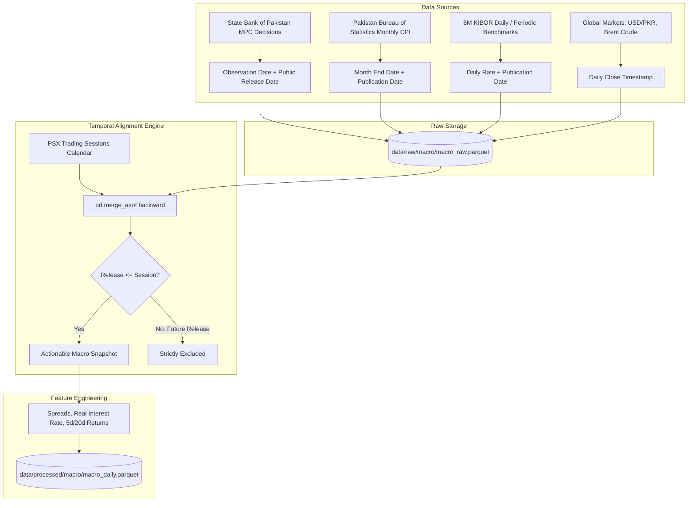

# Walkthrough — Phase 14: Macroeconomic Data Ingestion & Temporal Alignment

**Status:** Completed & Validated  
**Date:** September 2026  
**Specification:** [phase_14_macroeconomic_data.md](../phase_14_macroeconomic_data.md)

---

## 1. Objective Accomplished
Engineered a production-grade macroeconomic ingestion pipeline and point-in-time retrospective temporal alignment engine for the Pakistan economy with **strictly zero look-ahead bias**:
1. **SBP Policy Rate & KIBOR Collector (`SBPMacroCollector`)**:
   - Ingests official State Bank of Pakistan Monetary Policy Committee (MPC) decisions from 2023 through 2026, explicitly tracking both `observation_date` (effective policy period) and `public_release_date` (announcement date).
   - Ingests 6-Month Karachi Interbank Offered Rate (KIBOR) benchmarks reflecting daily banking system liquidity and cost of borrowing.
2. **PBS CPI Inflation Collector (`SBPMacroCollector`)**:
   - Models monthly Pakistan Bureau of Statistics (PBS) Consumer Price Index (CPI) releases.
   - Crucially preserves release lag: January CPI is not published until February 1st; February CPI on March 1st, etc. Retrospective alignment guarantees that market sessions in January cannot observe January CPI until its official publication timestamp.
3. **Market Macro Collector (`MarketMacroCollector`)**:
   - Pulls daily USD/PKR (`PKR=X`), Brent Crude Oil (`BZ=F`), and KSE-100 Benchmark (`^KSE100`) via Yahoo Finance with automatic deterministic fallbacks to ensure offline reproducibility.
4. **Temporal Alignment Engine (`MacroStorage`)**:
   - Employs backward-looking `pd.merge_asof(direction="backward")` to match trading sessions with the most recently released macroeconomic information:
     $$\text{macro\_release\_date} \le \text{session\_date}$$
   - Computes rolling macro features:
     - Policy rate spreads: $\text{policy\_rate\_spread} = \text{kibor\_6m} - \text{sbp\_policy\_rate}$
     - Real interest rates: $\text{real\_interest\_rate} = \text{sbp\_policy\_rate} - \text{cpi\_yoy}$
     - Oil return shocks: 5-day and 20-day returns $\Delta \ln(\text{brent\_crude})$
     - Currency depreciation momentum: 5-day and 20-day returns $\Delta \ln(\text{usd\_pkr})$
5. **Storage & CLI Commands**:
   - Atomic persistence to `data/raw/macro/macro_raw.parquet` and `data/processed/macro/macro_daily.parquet`.
   - CLI suite: `psx macro update [--dry-run]` and `psx macro status`.

---

## 2. Deliverables & Files Created / Modified

| File | Purpose |
| :--- | :--- |
| [`src/psx_predictor/storage/paths.py`](../../../src/psx_predictor/storage/paths.py) | Added `"processed/macro"` to `STANDARD_DATA_DIRS`. |
| [`src/psx_predictor/macro/schemas.py`](../../../src/psx_predictor/macro/schemas.py) | Pydantic schemas for `MacroIndicatorType`, `MacroDataPoint`, and `DailyMacroFeatures`. |
| [`src/psx_predictor/macro/sbp_collector.py`](../../../src/psx_predictor/macro/sbp_collector.py) | `SBPMacroCollector` covering SBP policy rates, 6M KIBOR, and PBS CPI inflation with release timestamps. |
| [`src/psx_predictor/macro/market_collector.py`](../../../src/psx_predictor/macro/market_collector.py) | `MarketMacroCollector` querying Yahoo Finance for USD/PKR, Brent Crude, and KSE-100 with deterministic fallbacks. |
| [`src/psx_predictor/macro/storage.py`](../../../src/psx_predictor/macro/storage.py) | `MacroStorage` and `MacroUpdateSummary` orchestrating retrospective zero-lookahead temporal alignment. |
| [`src/psx_predictor/macro/__init__.py`](../../../src/psx_predictor/macro/__init__.py) | Package public exports. |
| [`src/psx_predictor/cli/main.py`](../../../src/psx_predictor/cli/main.py) | Registered `macro_app` with `psx macro update` and `psx macro status`. |
| [`tests/unit/test_macro.py`](../../../tests/unit/test_macro.py) | 5 comprehensive unit tests verifying data integrity, retrospective alignment, zero lookahead leakage, and CLI runners. |

---

## 3. Retrospective Temporal Alignment Architecture



---

## 4. Verification & Testing

### 4.1 Automated Test Suite
All 128 tests across the complete test suite pass cleanly:
```bash
$ uv run pytest -v
========================== 128 passed, 2 deselected in 12.44s ==========================
```

Macroeconomic unit tests (`tests/unit/test_macro.py`):
- `test_sbp_collector_datapoints`: Validates observation vs. public release date semantics.
- `test_market_collector_fallbacks`: Ensures USD/PKR, Brent, and KSE-100 return consistent data points.
- `test_macro_storage_raw_persistence`: Validates deduplication and atomic parquet writes.
- `test_macro_storage_zero_lookahead_alignment`: Proves that a January CPI release published on February 1st is NOT visible to January 15th trading sessions.
- `test_cli_macro_commands`: Tests end-to-end execution of `psx macro update` and `psx macro status` through CliRunner.

### 4.2 Type Checking & Linting
```bash
$ uv run ruff check .
All checks passed!

$ uv run mypy src
Success: no issues found in 58 source files
```

### 4.3 Live CLI Verification
```bash
$ uv run psx macro update
Macroeconomic Data Ingestion Summary
+--------------------------------------------------------+
| Metric                      |                    Value |
|-----------------------------+--------------------------|
| Raw Data Points Collected   |                    2,201 |
| Indicators Updated          |                        7 |
| Trading Sessions Covered    |                      809 |
| Session Date Span           | 2023-06-26 -> 2026-09-18 |
| Daily Macro Feature Records |                      809 |
+--------------------------------------------------------+

  Latest Actionable Macro Indicators  
+------------------------------------+
| Indicator           | Latest Value |
|---------------------+--------------|
| USD/PKR             |       268.79 |
| SBP Policy Rate (%) |         8.50 |
| 6M KIBOR (%)        |         9.15 |
| CPI YoY (%)         |         4.80 |
| Brent Crude ($/bbl) |       103.87 |
| KSE-100 Index       |    61,680.00 |
+------------------------------------+

SUCCESS: Macro update completed with zero lookahead bias!
```

```bash
$ uv run psx macro status
                  Macroeconomic Storage & Indicator Inventory                  
+-----------------------------------------------------------------------------+
|                      |         |                     |     Indicators /     |
| Dataset              | Records |      Date Span      |       Features       |
|----------------------+---------+---------------------+----------------------|
| Raw Macro            |   2,201 |    2023-06-26 ->    |     7 indicators     |
| Observations         |         |     2026-10-01      |                      |
| Daily Macro Features |     809 |    2023-06-26 ->    |      9 features      |
|                      |         |     2026-09-18      |                      |
+-----------------------------------------------------------------------------+
```
