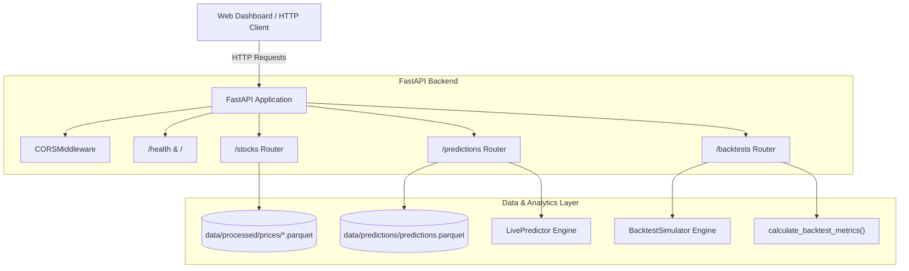

# Walkthrough — Phase 17: FastAPI REST Backend

**Status:** Completed & Validated  
**Date:** September 2026  
**Specification:** [phase_17_fastapi_backend.md](../phase_17_fastapi_backend.md)

---

## 1. Objective Accomplished
Built a high-performance, production-grade REST API using FastAPI and Uvicorn to serve PSX prediction intelligence, market historical series, audit logs, and backtesting simulations:

1. **Pydantic Response Schemas (`src/psx_predictor/api/schemas.py`)**:
   - Strictly validated contracts for system health (`HealthResponse`), universe summaries (`StockSummary`), historical OHLCV data (`StockHistoryResponse`, `StockHistoryPoint`), forward predictions (`LatestPredictionResponse`, `FeatureDriver`), audit logs (`PredictionRecordItem`), and backtesting equity curves (`BacktestSummaryResponse`, `EquityPoint`).
2. **Modular API Route Hierarchy (`src/psx_predictor/api/routes/`)**:
   - **Universe & Price Series (`routes/stocks.py`)**:
     - `GET /stocks`: Universe listings with sector filtering and parquet data availability.
     - `GET /stocks/{symbol}`: Granular metadata, sector, and session count for a single PSX stock.
     - `GET /stocks/{symbol}/history`: Clean OHLCV timeseries with configurable `days` window.
   - **Predictions & Audit Trail (`routes/predictions.py`)**:
     - `GET /stocks/{symbol}/latest-prediction`: Latest directional forecast, calibrated probability, buy/sell/hold signal, confidence score, and top feature drivers. Supports on-the-fly live prediction fallback.
     - `GET /predictions`: Historical audit trail queryable by ticker symbol and pending/resolved status.
   - **Backtesting & Simulation (`routes/backtests.py`)**:
     - `GET /backtests/{symbol}`: On-demand simulation of strategies (`sma_crossover`, `buy_and_hold`, `momentum`) accounting for transaction costs and returning Sharpe ratio, CAGR, max drawdown, win rate, and session-by-session equity curves.
3. **Application Factory & Middleware (`src/psx_predictor/api/app.py`)**:
   - `create_app(data_dir=...)`: Factory supporting dynamic storage isolation for hermetic testing.
   - Configured Cross-Origin Resource Sharing (CORS) with `allow_origins=["*"]` for web dashboards.
   - Standard `/health` diagnostic probe and `/` welcome documentation router.
4. **CLI Integration (`psx api start`)**:
   - Added `psx api start` command to Typer CLI with `--host`, `--port`, `--reload`, and `--dry-run` options.

---

## 2. Deliverables & Files Created / Modified

| File | Purpose |
| :--- | :--- |
| [`src/psx_predictor/api/schemas.py`](../../../src/psx_predictor/api/schemas.py) | Strongly-typed Pydantic request and response schemas. |
| [`src/psx_predictor/api/routes/stocks.py`](../../../src/psx_predictor/api/routes/stocks.py) | Endpoints for stock universe and historical OHLCV price series. |
| [`src/psx_predictor/api/routes/predictions.py`](../../../src/psx_predictor/api/routes/predictions.py) | Endpoints for latest predictions and append-only audit registry. |
| [`src/psx_predictor/api/routes/backtests.py`](../../../src/psx_predictor/api/routes/backtests.py) | Endpoints for running interactive backtests with PSX transaction costs. |
| [`src/psx_predictor/api/routes/__init__.py`](../../../src/psx_predictor/api/routes/__init__.py) | Exported sub-routers for modular mounting. |
| [`src/psx_predictor/api/app.py`](../../../src/psx_predictor/api/app.py) | Application factory `create_app()` with CORS, health check, and docs. |
| [`src/psx_predictor/api/__init__.py`](../../../src/psx_predictor/api/__init__.py) | Exported `create_app` entry point. |
| [`src/psx_predictor/cli/main.py`](../../../src/psx_predictor/cli/main.py) | Registered `api_app` and `psx api start` CLI command. |
| [`tests/unit/test_api.py`](../../../tests/unit/test_api.py) | 15 unit tests validating all endpoints, 404/400 errors, and CLI dry-run. |

---

## 3. REST API Architecture



---

## 4. Verification & Automated Testing

### Unit Test Suite (`tests/unit/test_api.py`)
All 15 API tests pass cleanly with 100% deterministic local data:
- `test_health_endpoint`: Asserts 200 OK, version, database status, and stock universe count.
- `test_root_endpoint`: Asserts 200 OK and documentation paths.
- `test_stocks_list_endpoint`: Asserts non-empty universe and data session counts.
- `test_stocks_filter_by_sector`: Asserts sector filtering logic.
- `test_stock_detail_endpoint`: Asserts single stock metadata extraction.
- `test_stock_detail_not_found`: Asserts HTTP 404 for unconfigured tickers.
- `test_stock_history_endpoint`: Asserts OHLCV timeseries serialization and date aliasing.
- `test_stock_history_not_found`: Asserts HTTP 404 when parquet prices are missing.
- `test_predictions_list_endpoint`: Asserts retrieval of historical audit registry records.
- `test_latest_prediction_endpoint`: Asserts forecast direction, probability, signal, and drivers.
- `test_latest_prediction_not_found`: Asserts HTTP 404 when no forecast is registered.
- `test_backtest_endpoint`: Asserts simulation execution, Sharpe, drawdown, and equity curve points.
- `test_backtest_unknown_strategy`: Asserts HTTP 400 validation error for unknown strategies.
- `test_backtest_missing_symbol`: Asserts HTTP 404 for un-bootstrapped symbols.
- `test_cli_api_start_dry_run`: Asserts CLI dry-run invocation and port configuration printing.

### Global Test Suite
- Total tests passing across repository: **155 passed** (0 failures, 0 errors).
- Linting & Types: **0 Ruff errors**, **0 Mypy type issues** in 69 source files.

```bash
uv run pytest tests/unit/test_api.py -v
# 15 passed in 1.88s

uv run psx api start --port 8000 --dry-run
# Initializing PSX Predictor REST API on 127.0.0.1:8000 | Reload: OFF | Mode: DRY-RUN
# SUCCESS: FastAPI app initialized successfully with 9 routes registered. Ready to serve!
```
