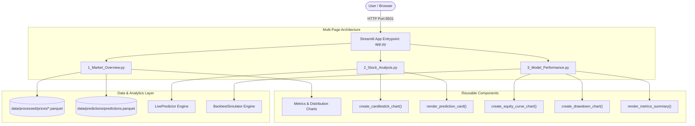

# Walkthrough — Phase 18: Streamlit Research Dashboard

**Status:** Completed & Validated  
**Date:** September 2026  
**Specification:** [phase_18_streamlit_dashboard.md](../phase_18_streamlit_dashboard.md)

---

## 1. Objective Accomplished
Engineered a modern, interactive, multi-page research and analytics dashboard using Streamlit and Plotly for the Pakistan Stock Exchange (PSX) Prediction Platform:

1. **Interactive Visualization Components (`src/psx_predictor/dashboard/components/charts.py`)**:
   - `create_candlestick_chart`: High-resolution multi-panel Plotly figure displaying OHLCV candlesticks, trading volume bars (green/red based on session return), SMA 20 & SMA 50 trend overlays, and 2-standard-deviation Bollinger Bands with soft fills in dark theme (`#0e1117`).
   - `create_equity_curve_chart`: Interactive portfolio growth progression comparing quantitative strategies against the Buy-and-Hold benchmark in Pakistani Rupees (PKR).
   - `create_drawdown_chart`: Underwater drawdown profile rendering drawdowns as shaded red area charts.
2. **Predictive & Performance Cards (`components/prediction_card.py`, `components/metrics_table.py`)**:
   - `render_prediction_card`: Color-coded signal badges (🟢 `BUY`, 🔴 `SELL`, 🟡 `HOLD`), calibrated probability progress meters, model confidence metrics, and horizontal bar charts of top predictive feature drivers.
   - `render_metrics_summary`: Top-level performance KPI grid displaying Sharpe Ratio, CAGR, Total Return %, Max Drawdown %, and Win Rate %.
   - `render_trades_table`: Tabular display of simulated trade executions with side, execution price, friction, and net value.
3. **Multi-Page Dashboard Suite (`src/psx_predictor/dashboard/`)**:
   - **`app.py` (Home/Landing View)**: System diagnostics, active universe tracking status, Parquet data availability counter, and quick navigation guides.
   - **`pages/1_Market_Overview.py`**: Full universe overview table with latest closing prices, 1-day percentage change, sector tags, latest machine learning signals, and interactive sector/signal distribution charts.
   - **`pages/2_Stock_Analysis.py`**: Deep-dive individual stock profile with configurable lookback sliders, technical indicator toggles, forward-looking prediction cards, and on-demand live prediction triggering.
   - **`pages/3_Model_Performance.py`**: Strategy backtesting simulator evaluating Moving Average Crossovers, 1-Day Momentum, and Buy-and-Hold benchmarks with realistic PSX commissions, regulatory turnover fees, and slippage.
4. **CLI Integration**:
   - Registered `psx dashboard [--port] [--host] [--dry-run]` command on the Typer CLI.

---

## 2. Deliverables & Files Created / Modified

| File | Purpose |
| :--- | :--- |
| [`src/psx_predictor/dashboard/components/charts.py`](../../../src/psx_predictor/dashboard/components/charts.py) | Interactive Plotly candlestick, equity curve, and drawdown figures. |
| [`src/psx_predictor/dashboard/components/prediction_card.py`](../../../src/psx_predictor/dashboard/components/prediction_card.py) | Streamlit UI card for directional signals, probability, and feature drivers. |
| [`src/psx_predictor/dashboard/components/metrics_table.py`](../../../src/psx_predictor/dashboard/components/metrics_table.py) | KPI metric tiles and trade execution log viewer. |
| [`src/psx_predictor/dashboard/components/__init__.py`](../../../src/psx_predictor/dashboard/components/__init__.py) | Exported reusable dashboard components. |
| [`src/psx_predictor/dashboard/app.py`](../../../src/psx_predictor/dashboard/app.py) | Multi-page Streamlit application entrypoint. |
| [`src/psx_predictor/dashboard/__init__.py`](../../../src/psx_predictor/dashboard/__init__.py) | Exported dashboard package entrypoint. |
| [`src/psx_predictor/dashboard/pages/1_Market_Overview.py`](../../../src/psx_predictor/dashboard/pages/1_Market_Overview.py) | Full-universe monitoring, price changes, and signal distributions. |
| [`src/psx_predictor/dashboard/pages/2_Stock_Analysis.py`](../../../src/psx_predictor/dashboard/pages/2_Stock_Analysis.py) | Technical analysis and explainable ML forecast profile. |
| [`src/psx_predictor/dashboard/pages/3_Model_Performance.py`](../../../src/psx_predictor/dashboard/pages/3_Model_Performance.py) | Strategy simulation, equity progression, and drawdown analysis. |
| [`src/psx_predictor/cli/main.py`](../../../src/psx_predictor/cli/main.py) | Registered `psx dashboard` CLI command. |
| [`tests/unit/test_dashboard.py`](../../../tests/unit/test_dashboard.py) | 6 unit tests validating component imports, chart generation, and CLI dry-run. |

---

## 3. Dashboard Architecture



---

## 4. Verification & Automated Testing

### Unit Test Suite (`tests/unit/test_dashboard.py`)
- `test_dashboard_imports_cleanly`: Verifies all components and entrypoints load without syntax or runtime import errors.
- `test_candlestick_chart_generation`: Asserts multi-trace Plotly candlestick figure generation with price, volume, SMA, and Bollinger Bands.
- `test_candlestick_chart_empty_dataframe`: Verifies graceful handling of empty datasets.
- `test_equity_curve_chart_generation`: Asserts multi-trace strategy vs benchmark equity figure.
- `test_drawdown_chart_generation`: Asserts underwater drawdown area curve generation.
- `test_cli_dashboard_dry_run`: Tests `psx dashboard --dry-run` invocation via `CliRunner`.

### Global Test Suite
- Total tests passing across repository: **161 passed** (0 failures, 0 errors).
- Linting & Types: **0 Ruff errors**, **0 Mypy type issues** in 78 source files.

```bash
uv run pytest tests/unit/test_dashboard.py -v
# 6 passed in 8.14s

uv run psx dashboard --dry-run
# Initializing PSX Predictor Streamlit Dashboard on 127.0.0.1:8501 | Mode: DRY-RUN
# SUCCESS: Dashboard entrypoint verified at D:\Development\PSX_Prediction\src\psx_predictor\dashboard\app.py. Ready to serve!
```
