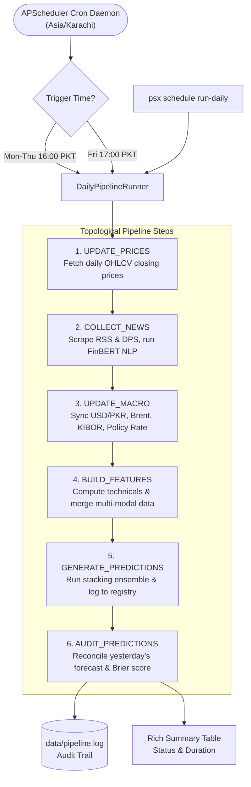

# Walkthrough — Phase 19: Daily Scheduled Automation

**Status:** Completed & Validated  
**Date:** September 2026  
**Specification:** [phase_19_scheduling.md](../phase_19_scheduling.md)

---

## 1. Objective Accomplished
Engineered a robust, fault-tolerant daily scheduled operational pipeline orchestrator for the Pakistan Stock Exchange (PSX) Prediction Platform:

1. **Topological Pipeline Job Definitions (`src/psx_predictor/scheduler/jobs.py`)**:
   - `DailyPipelineStep`: Ordered enumeration of operational tasks:
     1. `UPDATE_PRICES`: Incremental ingestion of daily OHLCV closing prices for enabled universe.
     2. `COLLECT_NEWS`: Scraping financial news via RSS and corporate announcements via DPS with FinBERT NLP sentiment scoring.
     3. `UPDATE_MACRO`: Synchronization of USD/PKR, Brent crude, KIBOR, and SBP monetary policy rates.
     4. `BUILD_FEATURES`: Engineering updated technical indicators, calendar variables, and multi-modal merged matrices.
     5. `GENERATE_PREDICTIONS`: Out-of-sample forward inference using the multi-model stacking ensemble and prediction registry logging.
     6. `AUDIT_PREDICTIONS`: Prediction outcome reconciliation against realized returns and Brier score evaluation.
   - `PipelineTaskResult` & `PipelineRunReport`: Strongly-typed execution metadata with per-step durations, error capturing, and JSON serialization.
   - `create_cron_triggers`: Session-aligned APScheduler `CronTrigger` rules mapped to PSX operational trading hours in `Asia/Karachi` timezone:
     - **Monday to Thursday:** Market closes at 15:30 PKT $\to$ Automated pipeline runs at 16:00 PKT.
     - **Friday:** Market closes at 16:30 PKT $\to$ Automated pipeline runs at 17:00 PKT.

2. **Pipeline Runner & Daemon Orchestrator (`src/psx_predictor/scheduler/runner.py`)**:
   - `DailyPipelineRunner`: Orchestrator managing end-to-end execution, exponential backoff retries on transient errors, graceful error handling with `continue_on_error` option, and formatted Rich table output.
   - Audit Logging: Atomic appending of complete run reports to `data/pipeline.log` in JSON Lines format for monitoring and provenance.
   - Daemon Mode: Integration with APScheduler `BlockingScheduler` and `BackgroundScheduler` for unattended production deployment.

3. **Typer CLI Suite (`src/psx_predictor/cli/main.py`)**:
   - `psx schedule status`: Visual table displaying PSX session timings, active triggers, and recent run history from `pipeline.log`.
   - `psx schedule run-daily [--dry-run] [--continue-on-error] [--symbols]`: Immediate manual execution of the 6-step EOD pipeline.
   - `psx schedule start [--daemon]`: Launching long-running scheduler process.

4. **Testing Suite (`tests/unit/test_scheduler.py`)**:
   - 8 unit tests validating step sequence, cron trigger generation, dry-run execution, skipped-step behavior on failure, exponential backoff retries, and CLI commands.

---

## 2. Deliverables & Files Created / Modified

| File | Purpose |
| :--- | :--- |
| [`src/psx_predictor/scheduler/jobs.py`](../../../src/psx_predictor/scheduler/jobs.py) | Topological pipeline step enum, task result dataclasses, and PSX cron triggers. |
| [`src/psx_predictor/scheduler/runner.py`](../../../src/psx_predictor/scheduler/runner.py) | End-of-day pipeline orchestrator, retry logic, logfile manager, and daemon runner. |
| [`src/psx_predictor/scheduler/__init__.py`](../../../src/psx_predictor/scheduler/__init__.py) | Exported scheduler public APIs. |
| [`src/psx_predictor/cli/main.py`](../../../src/psx_predictor/cli/main.py) | Typer CLI subcommands under `psx schedule` (`status`, `run-daily`, `start`). |
| [`tests/unit/test_scheduler.py`](../../../tests/unit/test_scheduler.py) | 8 unit tests covering execution, fault recovery, triggers, and CLI commands. |
| [`pyproject.toml`](../../../pyproject.toml) | Added `apscheduler>=3.10.4` dependency. |

---

## 3. Pipeline Architecture



---

## 4. Verification & Testing

### 4.1 Unit Testing
Executed via `uv run pytest tests/unit/test_scheduler.py -v`:
- `test_pipeline_step_definitions_and_ordering`: Verified correct 6-step ordering.
- `test_cron_triggers_creation`: Verified Mon-Thu 16:00 and Fri 17:00 triggers for `Asia/Karachi`.
- `test_pipeline_task_result_and_report_serialization`: Verified dictionary serialization.
- `test_pipeline_dry_run_execution`: Verified all 6 steps complete with `SUCCESS` and update `pipeline.log`.
- `test_pipeline_failure_halts_remaining_steps`: Verified that when a step fails, subsequent steps are marked `SKIPPED` when `continue_on_error=False`.
- `test_pipeline_retry_mechanism_recovers`: Verified exponential backoff recovers from transient errors.
- `test_cli_schedule_status`: Verified CLI outputs market sessions and trigger table cleanly.
- `test_cli_schedule_run_daily_dry_run`: Verified CLI executes dry-run pipeline with exit code 0.

### 4.2 Full Regression Suite
- Total test count: **169 tests passed**, 2 deselected, 0 failures.
- Static typing: `uv run mypy src` passed with **0 issues across 81 source files**.
- Linting & formatting: `uv run ruff check .` passed with **0 errors**.

### 4.3 CLI Verification Output
```text
PSX Predictor Automated Pipeline Status
Timezone: Asia/Karachi
Audit Log: data\pipeline.log

                 EOD Market Sessions & Pipeline Triggers
+--------------------+---------------+-------------------+----------------------------+
| Market Session     | Market Close  | EOD Trigger Time  | Topological Steps          |
+--------------------+---------------+-------------------+----------------------------+
| Monday - Thursday  | 15:30 PKT     | 16:00 PKT         | Prices -> News -> Macro -> |
|                    |               |                   | Features -> Predict ->     |
|                    |               |                   | Audit                      |
| Friday             | 16:30 PKT     | 17:00 PKT         | Prices -> News -> Macro -> |
|                    |               |                   | Features -> Predict ->     |
|                    |               |                   | Audit                      |
+--------------------+---------------+-------------------+----------------------------+
```
