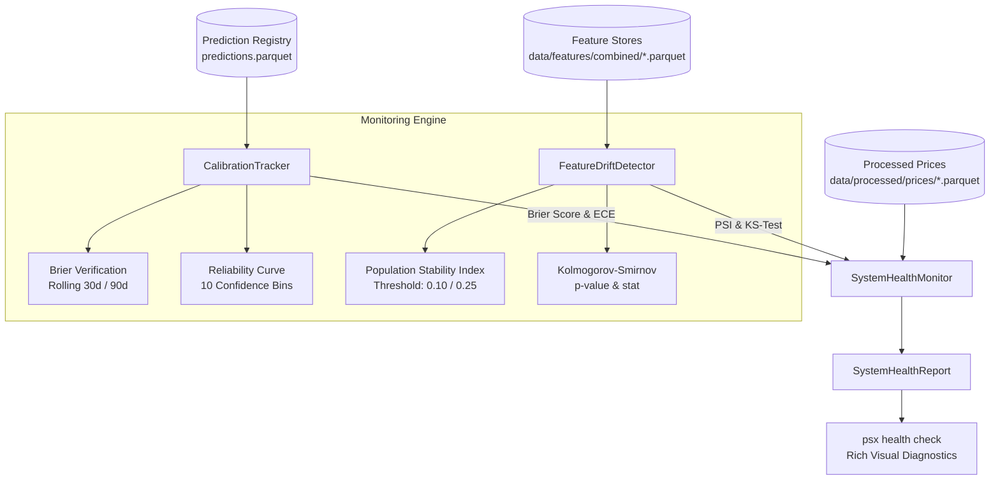

# Walkthrough — Phase 20: Model Monitoring & Drift Detection

**Status:** Completed & Validated  
**Date:** September 2026  
**Specification:** [phase_20_monitoring.md](../phase_20_monitoring.md)

---

## 1. Objective Accomplished
Engineered a comprehensive real-time statistical monitoring, probability calibration, feature drift detection, and system health audit engine for the Pakistan Stock Exchange (PSX) Prediction Platform:

1. **Probability Calibration & Reliability Tracking (`src/psx_predictor/monitoring/calibration.py`)**:
   - `compute_brier_score`: Computes the verification Brier score:
     $$\text{Brier} = \frac{1}{N}\sum_{i=1}^N (P_i - y_i)^2$$
     with valid range $[0.0, 1.0]$, where uninformative coin-flip prediction yields $0.25$.
   - `compute_calibration_curve`: Constructs 10 uniform confidence bins comparing mean predicted probabilities against empirical positive realization frequencies.
   - `compute_expected_calibration_error`: Weighted Expected Calibration Error (ECE) across confidence partitions:
     $$\text{ECE} = \sum_{b=1}^B \frac{N_b}{N} |\text{acc}(B_b) - \text{conf}(B_b)|$$
   - `CalibrationTracker`: Analyzes resolved prediction outcomes from `PredictionRegistry`, tracking rolling 30-day, 90-day, and all-time Brier scores and assigning operational calibration status (`HEALTHY`, `MODERATE_MISCALIBRATION`, `SEVERE_MISCALIBRATION`).

2. **Feature Distribution Drift Detection (`src/psx_predictor/monitoring/drift.py`)**:
   - `compute_psi`: Quantile-based Population Stability Index (PSI) with epsilon-smoothed empirical binning:
     $$\text{PSI} = \sum_{k=1}^K (\text{Actual}_k - \text{Expected}_k) \times \ln\left(\frac{\text{Actual}_k}{\text{Expected}_k}\right)$$
   - Standard Quantitative Thresholds:
     - $\text{PSI} < 0.10$: Distribution stable (`STABLE`).
     - $0.10 \le \text{PSI} < 0.25$: Moderate shift (`WARNING`).
     - $\text{PSI} \ge 0.25$: Significant shift (`ALERT` $\to$ triggers automated retraining recommendation).
   - `compute_ks_drift`: Non-parametric two-sample Kolmogorov-Smirnov test via `scipy.stats.ks_2samp` providing supremum distance statistic and asymptotic p-value.
   - `FeatureDriftDetector`: Multi-feature and per-symbol drift assessment comparing trailing live operational sessions against training baseline distributions.

3. **System Health & Diagnostic Engine (`src/psx_predictor/monitoring/health.py`)**:
   - `SystemHealthMonitor`: Consolidated platform diagnostics evaluating:
     1. **Data Feed Freshness & Continuity**: Recency of daily closing prices across active universe and detection of missing business-day gaps.
     2. **Model Audit Reliability**: Pending vs. resolved prediction backlog, rolling hit rates, and probability calibration.
     3. **Distributional Drift**: Detection of alerting symbols and features exceeding PSI thresholds.
   - Aggregates status into `HEALTHY`, `DEGRADED`, or `CRITICAL` with contextual actionable remediation advice.

4. **CLI Diagnostics Suite (`src/psx_predictor/cli/main.py`)**:
   - `psx health check [--symbols] [--detailed]`: Visual terminal dashboard with status badges, subsystem KPI table, and actionable recommendations.
   - `psx health drift [--symbol] [--recent-sessions] [--reference-sessions]`: Granular feature-level breakdown of PSI, KS statistic, and p-value.

5. **Testing Suite (`tests/unit/test_monitoring.py`)**:
   - 10 unit tests covering Brier mathematical exactness, calibration curves, ECE, PSI stability & drift triggers, KS-test, data feed health, and CLI commands.

---

## 2. Deliverables & Files Created / Modified

| File | Purpose |
| :--- | :--- |
| [`src/psx_predictor/monitoring/calibration.py`](../../../src/psx_predictor/monitoring/calibration.py) | Brier verification score, reliability diagram bins, ECE, and CalibrationTracker. |
| [`src/psx_predictor/monitoring/drift.py`](../../../src/psx_predictor/monitoring/drift.py) | Population Stability Index (PSI), two-sample KS-test, and FeatureDriftDetector. |
| [`src/psx_predictor/monitoring/health.py`](../../../src/psx_predictor/monitoring/health.py) | System health monitor aggregating data feeds, model audit, and drift into health reports. |
| [`src/psx_predictor/monitoring/__init__.py`](../../../src/psx_predictor/monitoring/__init__.py) | Exported monitoring public APIs. |
| [`src/psx_predictor/cli/main.py`](../../../src/psx_predictor/cli/main.py) | Registered `psx health check` and `psx health drift` CLI subcommands. |
| [`tests/unit/test_monitoring.py`](../../../tests/unit/test_monitoring.py) | 10 unit tests verifying calibration, drift, health, and CLI execution. |

---

## 3. Monitoring Architecture



---

## 4. Verification & Testing

### 4.1 Unit Testing
Executed via `uv run pytest tests/unit/test_monitoring.py -v`:
- `test_brier_score_computation_exact`: Verified exact mathematical scores (0.0 for perfect, 1.0 for inverted, 0.25 for coin flip).
- `test_calibration_curve_and_ece`: Verified 10-bin calibration partitioning and low ECE for calibrated series.
- `test_calibration_tracker_alerts`: Verified transition to `SEVERE_MISCALIBRATION` on biased predictions and `HEALTHY` on calibrated predictions.
- `test_psi_identical_distributions`: Verified identical distributions yield $PSI < 0.05$.
- `test_psi_detects_distributional_shift`: Verified moderate shift yields warning and severe shift ($\Delta\mu = 2.0$) triggers $PSI \ge 0.25$.
- `test_ks_drift_detection`: Verified KS-test p-value accurately drops below $10^{-5}$ on shifted distributions.
- `test_feature_drift_detector_dataframe`: Verified multi-feature evaluation correctly flags drifted features.
- `test_data_feed_health_fresh_and_stale`: Verified discrimination between fresh and stale price series.
- `test_cli_health_check`: Verified clean terminal rendering and exit code 0.
- `test_cli_health_drift_no_features`: Verified graceful handling when features are pending generation.

### 4.2 Full Regression Suite
- Total test count: **179 passed**, 2 deselected, 0 failures across 21 test modules.
- Static typing: `uv run mypy src` passed with **0 issues across 85 source files**.
- Linting & formatting: `uv run ruff check .` passed with **0 errors**.

### 4.3 CLI Verification Output
```text
+-------------------- PSX Predictor - System Health Audit --------------------+
| Status: CRITICAL | Checked at: 2026-09-19T14:46:44                          |
| Data Feed: CRITICAL | Model Calibration: HEALTHY | Feature Drift: HEALTHY   |
+-----------------------------------------------------------------------------+

                           Subsystem Health Summary                            
+-----------------------------------------------------------------------------+
| Subsystem          |  Status  | Key Metrics / Findings                      |
|--------------------+----------+---------------------------------------------|
| Data Feeds         | CRITICAL | 0/11 active feeds ok. Latest: 2026-09-03    |
| Model Reliability  | HEALTHY  | 0/2 ok | Hit Rate: 0.0% | Brier: N/A        |
|                    |          | | Calibration: HEALTHY                      |
| Distribution Drift | HEALTHY  | Evaluated: 0 symbols | Alerts: 0 |          |
|                    |          | Warnings: 0 | Retrain: NO                   |
+-----------------------------------------------------------------------------+

Actionable Recommendations:
  - Execute 'psx data update' or 'psx schedule run-daily' to refresh stale feeds.
```
